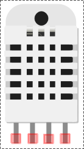
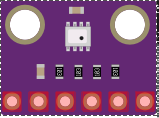
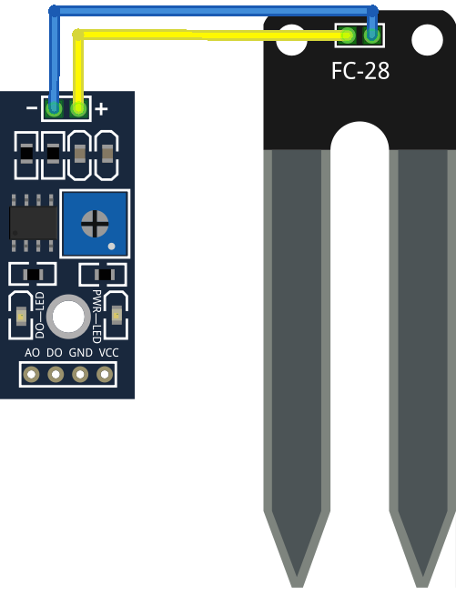
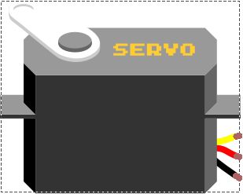
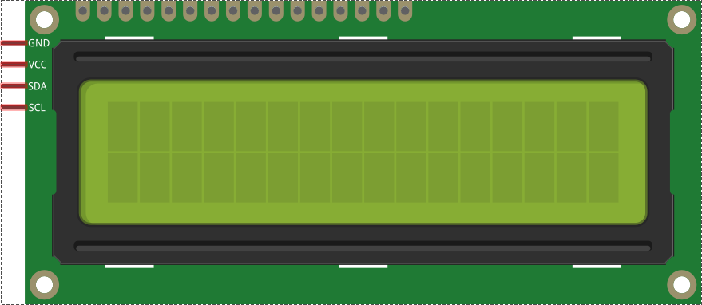
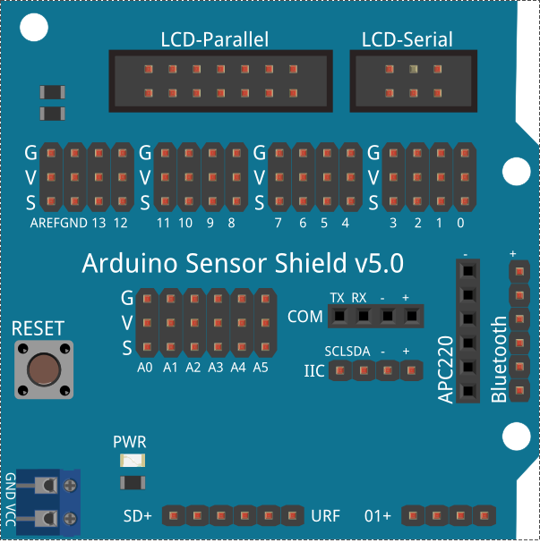
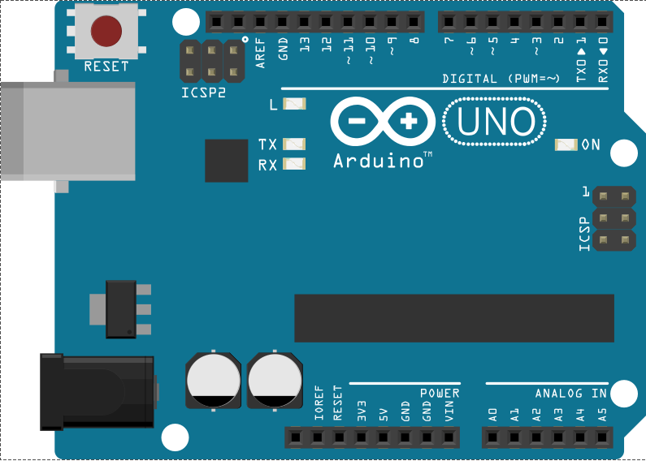

# Componentes

## Sensores

* [DHT22: Sensor de temperatura y humedad](./Componentes/DHT22.md)

* [BME280: Sensor de temperatura, presión y humedad](./Componentes/BME280.md)

* [LDR: sensor de luz](./Componentes/LDR.md)

* [Sensor de Humedad de Suelo](./Componentes/Sensor_Humedad_Suelo.md)

* [Sensor de Lluvia](./Componentes/Sensor_lluvia.md)

## Actuadores

* [Servo](./Componentes/Servo.md)

* [Relé](./Componentes/Rele.md)

* [LCD](./Componentes/LCD.md)

## Otros

* [Placa de prototipo (protoboard)](./Componentes/Protoboard.md)

* [Arduino Sensor Shield](./Componentes/Shield.md)

* [Arduino](./Componentes/Arduino.md)

* [RTC](./Componentes/RTC_1302.md)

