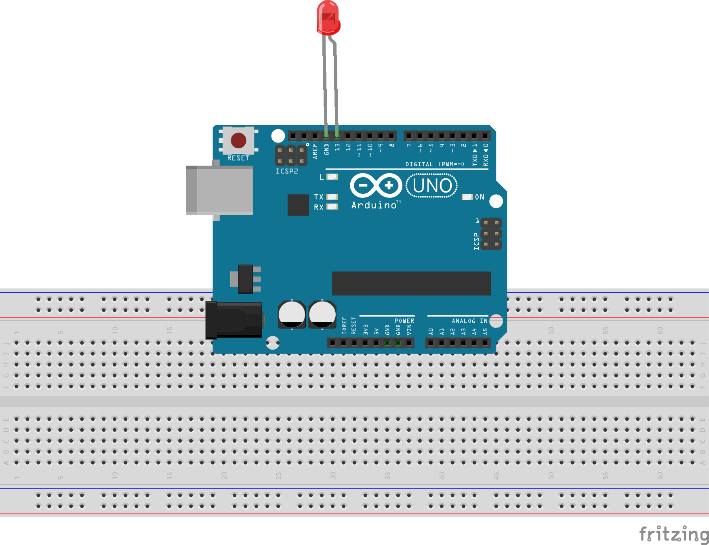
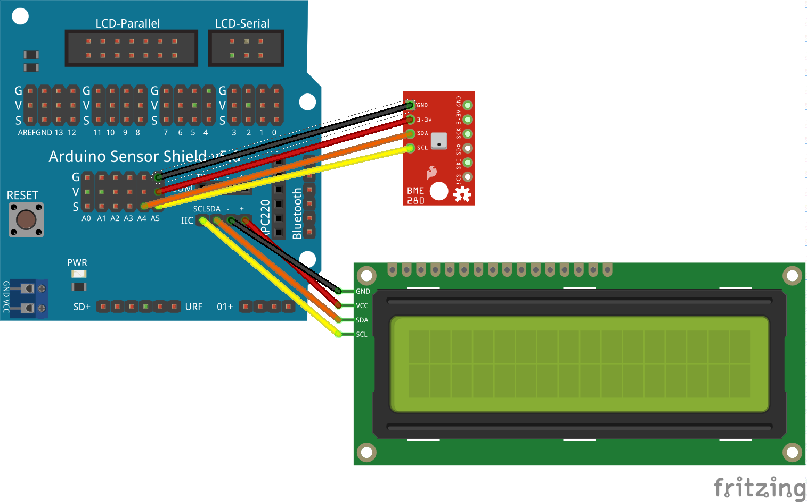

# SmartCities Base

## [Presentación](./Presentacion.md)

## [Kit de componentes](./Kit.md)

## [Componentes](./Componentes.md)

## Ejemplos

## Hello_Led    

Conectamos un led a la patilla 13 y lo encendemos y apagamos, es el "Hola Mundo" de Arduino!!

Detalles:
* Pines de Arduino
* Polaridad LED
* Necesidad de resistencia

Ejemplo: Base/1.Hello_Led

## Conexion_PC  

Utilizamos el ejemplo anterior para enviar mensajes al pc. Podemos verlos desde el monitor serie: Menu Herramientas/Monitor Serie

Ejemplo: Base/2.Conexion_PC

## LCD

Conectamos una pantalla LCD y aprendemos a mostrar contenidos

Detalles:
* Pines Shield
* I2C

Ejemplo: Base/3.LCD

## Sensor BME280

Usamos el sensor atmosférico BME280 para medir temperatura, presión y humedad ambiente

Ejemplo: Base/4_Meteo_BME280

## Configuración Wifi

Antes de continuar tenemos que aprender a utilizar el Wifi de Arduino

[Configuración Wifi](./wifi.md)

## Publicación de datos (ThingSpeak)

Usamos el montaje anterior para publicar los datos en el servicio de la nube [ThingSpeak](./ThingSpeak.md)

Ejemplo: Base/Base_Publicacion_ThingSpeak

## Publicacion y suscripcion a datos (MQTT)

Usamos el servicio [MQTT](./mqtt.md) tanto para publicar, como para suscribirnos a ciertos Temas

Ejemplo: Base/Publicacion_suscripcion_datos           

## Obtención del Pronostico_tiempo                       

Ejemplo que descarga el pronostico del tiempo desde el servicio WouldWeather

### Otros Ejemplos
RTC               
i2c_scanner     

WiFiWebServer
LCD_HelloWorld  
Publicacion_suscripcion_datos_refactor  
WifiScanNetworks
