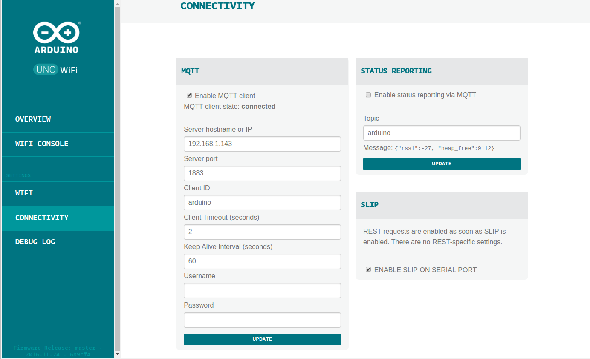

# MQTT

[¿Qué es MQTT](https://ricveal.com/blog/uso-mqtt/)

Es un sistema de mensajería que permite enviar mensajes con etiquetas que tiene una estructura jerárquica, similar a los directorio o urls. Podemos suscribirnos a un tema concreto o a una rama

    topic/sensor/temperatura

es más concreto que

    topic/sensor

Podemos suscribirnos a todos los mensajes que comparten una rama de un tema usando '#'

Por ejemplo topic/sensor/# no devulverá todos los que tengan esa parte del tema (más detalles en la [documentación de mosquitto](http://mosquitto.org/man/mqtt-7.html))

[Configurando Arduino y MQTT](https://ricveal.com/blog/arduino-mqtt/)

[MQTT in arduino, raspberry y ESP](https://www.baldengineer.com/mqtt-tutorial.html)

[MQTT in arduino Uno Wifi](https://www.trojanc.co.za/2017/02/08/arduino-uno-wifi-mqtt/)

[Referencia](https://iotasmarterplanet.wordpress.com/mqtt/publishing-sensor-data-from-arduino-to-raspberry-pi/)

## Instalación de MQTT en Raspberry ([Referencia](https://iotasmarterplanet.wordpress.com/mqtt/installing-mosquitto-on-to-the-pi/))

Instalamos el software Mosquitto (que implementa MQTT para Raspberry)

    sudo apt-get install mosquitto mosquitto-clients python-mosquitto

Instalamos tanto la parte server (broker) como el cliente

## Primeras pruebas

Nos subscribimos a un tema con

    mosquitto_sub -v -t "topic/test"

Desde otro terminal vamos a publicar un mensaje sobre este tema

    mosquitto_pub -t 'topic/test' -m 'Hello World!'

Y recibimos el contenido el suscriptor

## Publicando con Arduino  ([Referencia](https://iotasmarterplanet.wordpress.com/mqtt/mqtt-with-arduino-and-raspberry-pi/))

Para publicar con arduino, primero configuraremos MQTT desde el interface web

¡¡¡ Es fundamental activar el tick !!!!

Y luego usaremos el cliente ciao desde el código

    #include <Wire.h>
    #include <UnoWiFiDevEd.h>

    #define CONNECTOR "mqtt"
    #define TOPIC "arduino/analog/A1"

    void setup() {
     Ciao.begin();
    }

    void loop(){

     delay(5000);
     int data_value = analogRead(A1); // data value from analog pin 1
     Ciao.write(CONNECTOR, TOPIC, String(data_value)); // pushes data into a channel called PIN_A1

    }

## Recuperacion de mensajes MQTT

    void lee_comandos(){
       CiaoData data = Ciao.read(CONNECTOR, TOPIC_RIEGO_ON);
       if (!data.isEmpty()){
       const char* value = data.get(2);
       Serial.print(data.get(1));
       Serial.print(":");
       Serial.print(value);
       if(value[1]=='n'){
        enciendeRiego();
       }
       else {
        apagaRiego();
       }

    }
## Instalación de Node-red ([Referencia](https://iotasmarterplanet.wordpress.com/mqtt/installing-node-red-onto-pi/))
